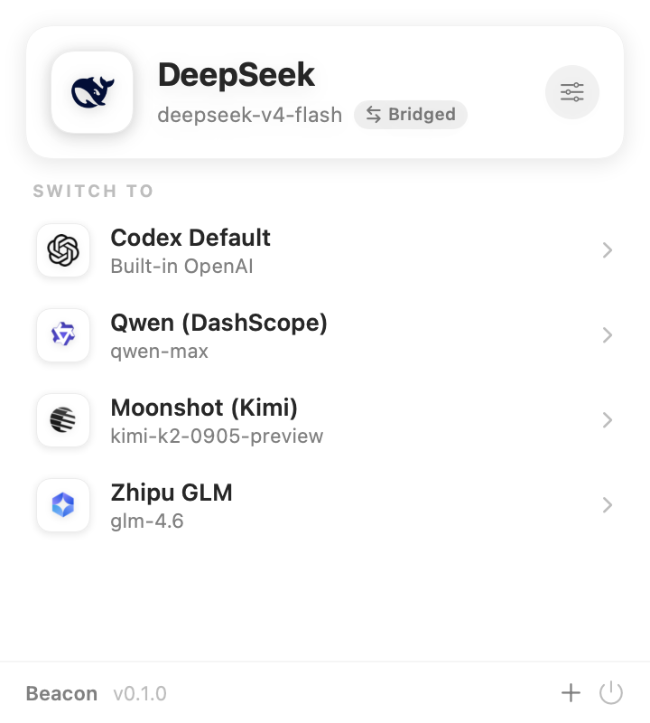

<p align="center">
  
</p>

<h1 align="center">Beacon</h1>

<p align="center">
  <a href="README.md">English</a> | <b>简体中文</b>
</p>

<p align="center">
  让 <b>OpenAI Codex CLI</b> 用上 DeepSeek、GLM、Kimi、Qwen 等模型 —— 一键切换服务商,
  内置 Chat&nbsp;↔&nbsp;Responses 翻译桥。
</p>

<p align="center">
  
  
  
</p>

<p align="center">
  
</p>

## 为什么需要 Beacon?

OpenAI 的 Codex CLI **只支持 Responses API**。但几乎所有第三方服务商 —— DeepSeek、
智谱 GLM、月之暗面 Kimi、Qwen、MiniMax…… —— **只提供 Chat Completions**。直接把 Codex
指过去,你会得到:

```text
■ unexpected status 404 Not Found, url: https://api.deepseek.com/v1/responses
```

常见做法是自己架一个转换网关(LiteLLM、代理……)。**Beacon 帮你在本地搞定,零配置。**
选一个服务商、打开一个开关,Codex 就能直接用 —— Beacon 在本机跑一个小桥,实时把
Responses ⇄ Chat Completions 互相翻译。

## 功能

- 🧭 **一键切换** —— 写入 `~/.codex/config.toml`,新增/更新 `[model_providers.<id>]` 块并
  切换 `model` / `model_provider`,同时**保留你其它所有配置**。
- 🌉 **内置 Chat↔Responses 桥** —— 无需外部网关,chat-only 服务商开箱即用。
- 🪪 **多服务商档案** —— 每个档案有自己的模型、密钥、推理强度,随时切换。
- 🎯 **干净的菜单栏 UI** —— 当前服务商一目了然,列表里点一下就切。
- 🔒 **本地、私密** —— 全程在你 Mac 上运行,密钥只存在你的 Codex 配置里。

## 支持的服务商

内置模板(也可把任意 OpenAI 兼容端点添加为 **Custom**):

| 原生 Responses API | 走桥(Chat Completions) |
| --- | --- |
| OpenAI · Azure OpenAI | DeepSeek · 智谱 GLM · z.ai · 月之暗面 Kimi · MiniMax · Qwen(DashScope)· ModelScope · OpenRouter · Ollama |

## 工作原理

激活一个走桥的服务商时,大致写入:

```toml
model = "deepseek-v4-flash"
model_provider = "deepseek"

[model_providers.deepseek]
name = "DeepSeek"
base_url = "http://127.0.0.1:51900/v1"   # Beacon 的本地桥
wire_api = "responses"
experimental_bearer_token = "beacon-bridge"
```

```
Codex ──/responses──▶  Beacon 桥(localhost)  ──/chat/completions──▶  DeepSeek
        ◀───────────  翻译 SSE 回传  ◀───────────────────────────
```

**Default** 项让 Codex 回到内置的 `openai` 服务商(用 `codex login` 单独登录)。原生服务商
(OpenAI / Azure)不走桥。

## 安装

### 直接下载(推荐)

从 [**Releases**](https://github.com/casperkwok/Beacon/releases/latest) 下载**已签名+公证**的版本,
解压后把 **Beacon.app** 拖进 `/Applications` 即可 —— 双击直接打开,无 Gatekeeper 警告。

### 从源码构建

Beacon 用 [XcodeGen](https://github.com/yonsm/XcodeGen) 生成工程,
[TOMLKit](https://github.com/LebJe/TOMLKit) 写配置:

```bash
brew install xcodegen     # 如未安装
git clone https://github.com/casperkwok/Beacon.git
cd Beacon
xcodegen generate         # 生成 Beacon.xcodeproj
open Beacon.xcodeproj      # 在 Xcode 16+ 构建运行 "Beacon" scheme
```

Beacon 以非沙盒方式运行,以便读写 `~/.codex/config.toml` 并运行本地桥。

## 使用

1. 点菜单栏的 Beacon 图标。
2. 点 **+**,选一个服务商模板,粘贴你的 API Key,**保存**。
3. 点列表里的某条激活它 —— Codex 下次启动时生效。
4. chat-only 服务商保持 **Translate Chat ↔ Responses** 打开即可(走桥的模板默认已开)。

## 常见问题

**Codex 里的 `Model metadata for … not found` 警告** —— Codex 只内置了 OpenAI 自家模型的
元数据,所以对任何自定义模型 id 都会提示。它是 cosmetic 的,模型照常工作,无法干净消除。

## 协议

[Apache License 2.0](LICENSE)。各服务商名称与 logo 为其各自所有者的商标,此处仅用于标识对应服务。
